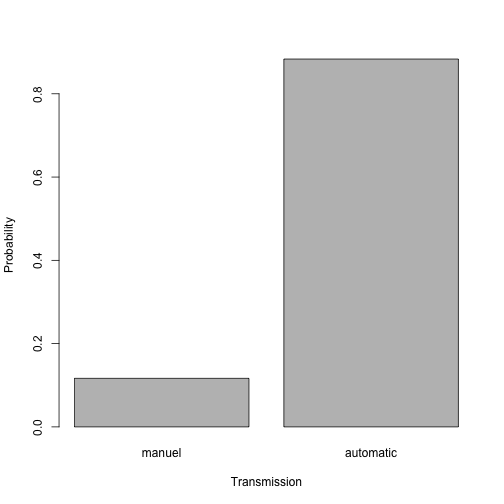
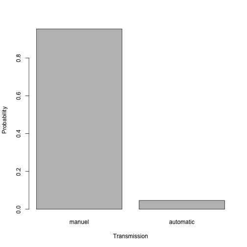

Pitching MyShinyApp
========================================================
author: elkemat
date: November 29, 2017
autosize: true


Background
========================================================

With MyShinyApp you can analyse the probability of a car having manual or 
automatic transmission based on 
- the miles per gallon  
- number of forward gears 


The Underlying Data
========================================================

The relevant variables for building the logistic regression model are the 
following:


```r
data <- data.frame(as.factor(mtcars$am), mtcars$mpg, as.factor(mtcars$gear))
names <- c("Transmission", "MPG", "Gears")
colnames(data) <- names
summary(data)
```

```
 Transmission      MPG        Gears 
 0:19         Min.   :10.40   3:15  
 1:13         1st Qu.:15.43   4:12  
              Median :19.20   5: 5  
              Mean   :20.09         
              3rd Qu.:22.80         
              Max.   :33.90         
```

Probability for Automatic vs. Manual Car
========================================================

For 15 miles per gallon and 4 forward gears, the probabilities would look like 
this:



Probability for Automatic vs. Manual Car
========================================================

Changing the value to 30 miles per gallon results in probabilities below. This 
shows that for cars with 4 forward gears, the miles per gallon are a good 
indication for the transmission (as automatic cars need less fuel).



